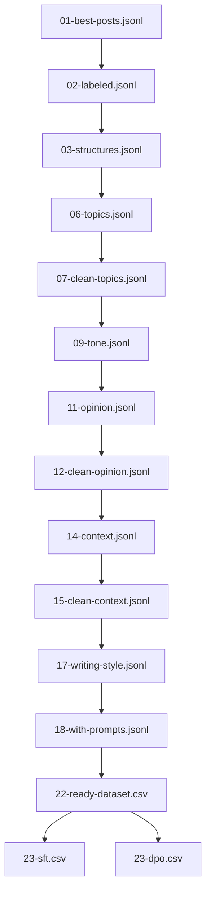

# LinkedIn Post ETL: Reproducible, Manifest‑Driven Pipeline (01 → 23)

A modern, manifest‑driven ETL that turns social posts into training‑ready datasets for LLM fine‑tuning. Heavy NLP (spaCy, NLTK) and vLLM are preserved; the system is optimized for performance, reproducibility, and multiple runs.

## Key capabilities

- Reproducible run‑id mode with manifest.json lineage and signature‑based skipping
- Standardized artifacts in data/processed/{RUN_ID}/ with stage‑numbered filenames
- vLLM guided decoding for structure (Stage 03); spaCy/NLTK writing‑style extraction (Stage 17)
- Prompt generation (Stage 18), dataset assembly (Stage 22), and balanced SFT/DPO splits (Stage 23)
- Deterministic seeding, logfmt logging, and validation gates before manifest updates

## Quickstart

```bash
cd pipe
make setup           # install package + dev tools
make setup-nlp       # one-time: download spaCy model + NLTK data
make smoke           # smoke test for 1 -> 2 -> 3 using run-id ergonomics
make run-tail RUN_ID=demo  # tail-only: 17-18, 22-23 (assumes features already exist for RUN_ID)
```

Inputs: use the tiny demo dataset `../course-dataset-clean.jsonl` (we’ll keep ~25 rows).

## Hardware requirements

This pipeline targets GPU-backed LLM fine-tuning and guided decoding. A data‑center NVIDIA GPU is required for vLLM stages and is strongly recommended end‑to‑end.

- Supported GPUs: NVIDIA A100 (40GB/80GB) minimum; H100/H200 preferred for throughput and long contexts
- CUDA: 12.1–12.3 recommended (ensure PyTorch/vLLM builds match). NVIDIA Driver ≥ 535
- Host: Python 3.9+, 32GB RAM+, fast SSD (10–50GB free for artifacts), Linux preferred
- Notes:
  - Ensure NCCL/CUDA toolkit versions match the installed PyTorch and vLLM wheels
  - Large models may require tensor/kv cache sharding or reduced batch sizes on A100‑40GB

## Data layout

All artifacts for a run are written under data/processed/{RUN_ID}/ with a manifest.json capturing lineage, signatures, and outputs.

Example structure:

```
data/processed/demo-run/
  01-best-posts.jsonl
  02-labeled.jsonl
  03-structures.jsonl
  17-posts-with-writing-style.jsonl
  18-with-prompts.jsonl
  22-ready-dataset.csv
  23-sft.csv
  23-dpo.csv
  manifest.json
```

Example manifest.json snippet:

```
{
  "run_id": "demo-run",
  "stages": {
    "18-prompts": {
      "input": "data/processed/demo-run/17-posts-with-writing-style.jsonl",
      "outputs": ["data/processed/demo-run/18-with-prompts.jsonl"],
      "signature": "sha256:…",
      "completed_at": "2025-08-24T12:34:56Z"
    }
  }
}
```


## Stages and artifacts

Written under `data/processed/{RUN_ID}/`:

- 01: 01-best-posts.jsonl
- 02: 02-labeled.jsonl
- 03: 03-structures.jsonl
- 17: 17-posts-with-writing-style.jsonl (+ 17-partial-results.jsonl during long runs)
- 18: 18-with-prompts.jsonl
- 22: 22-ready-dataset.csv (+ Parquet mirror)
- 23: 23-balanced-dataset.csv, 23-sft.csv, 23-dpo.csv (+ Parquet mirrors)

A `manifest.json` in the same folder records inputs, outputs, config signature, and timestamps.

## Why this matters

Training data pipelines for LLMs often break on reproducibility and scale. This repo shows:

- How to preserve heavy computation (vLLM, spaCy, NLTK) while adding run‑id manifests,
  deterministic seeding, and validation gates
- How to produce standardized, training‑ready artifacts for SFT/DPO/GRPO workflows
- How to optimize for multi‑run workflows with signature‑based skipping and reporting

## Architecture (DAG)



## Philosophy (Emulate Framework)

This pipeline is aligned with my “Emulate” approach: begin with the workflow you want to automate, encode expert‑style signals (features), and then package standardized supervision data for model training. The high‑level summary below provides context for why we focused on expert‑style feature extraction and standardized training artifacts.

### Executive Summary
Most AI deployments are information‑centric and underwhelming. The Emulate Framework is workflow‑first: it reverse‑engineers expert processes and encodes differentiating signals into AI capabilities that deliver measurable efficiency gains.

- Problem: information bots ≠ automated workflows; low leverage
- Solution: map expert workflows, capture differentiators, and build AI that completes tasks end‑to‑end
- Impact: real efficiency gains (often 60–80% time savings) and durable differentiation

### Philosophy highlights
- Product‑first, not data‑first
- Expertise over generic AI
- Competitive differentiation preserved
- Measurable efficiency via complete‑process automation

### Process overview
- Phase 1: Human Workflow Mapping (designed output, expert mapping, decomposition, target variables, quality definitions)
- Phase 2: Expert Style Fingerprinting (strategic data collection, differential feature engineering, impact validation, implementation)
- Phase 3: Modeling & Delivery (architectures, development/validation, packaging, implementation prep)

See the full philosophy section at the end of this README for the complete framework.

## Usage (selected commands)

- End-to-end (all features to final splits):
  - `make run-e2e RUN_ID=demo DATASET=../course-dataset-clean.jsonl`
- Tail-only (assumes features exist for RUN_ID):
  - `make run-tail RUN_ID=demo`  (note: 17-writing-style expects an explicit --input when using --run-id; see Makefile or pass --input)
- Core ingestion + structure only:
  - `make run-core RUN_ID=demo DATASET=../course-dataset-clean.jsonl`
- Feature extraction only (with cleaners):
  - `make run-features RUN_ID=demo`

## Additional topics

- Ablation outputs (Stage 4): micro‑ablation over structures with plots and a summary report
- Data versioning (Git LFS): Parquet and contract files tracked via LFS
- Reward aggregator and evaluation: modular rewards with weights + CPU‑only eval
- Orchestration (Prefect): optional flow for 17-23 + reward evaluation
- Streamlit demo: minimal scoring UI

## Validation and skip behavior

Each stage computes a signature from inputs + config + stage_version and skips when unchanged. Validation gates ensure only successful outputs are written to the manifest:

- 01: JSONL has post_text and tier
- 03: JSONL has post_text and structure in allowed set
- 17: JSONL has post_text
- 18: JSONL has prompt
- 22: CSV has system, prompt, chosen, rejected
- 23: CSV standardized outputs valid

## Tests and CI

- Run `make test` to execute unit/integration tests.
- A smoke script `tests/smoke_etl.sh` exercises 01-03.
- GitHub Actions workflow `.github/workflows/ci.yml` runs tests on push/PR.

## Full Emulate Framework

## Got a Project?

## Licensing

- Code in this repository is licensed under the Apache License, Version 2.0.
- Third‑party models (e.g., Qwen) and datasets are governed by their own licenses/terms; review and comply with those separately.


If you have a project that could benefit from the Emulate Framework, please reach out to discuss how we can work together. You can reach me at [LinkedIn](https://www.linkedin.com/in/jacobpaulwarren/).