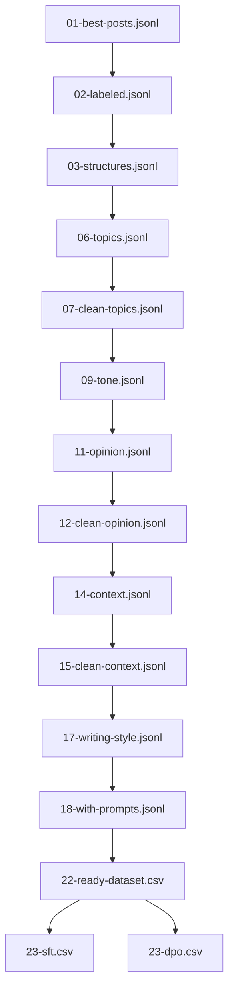
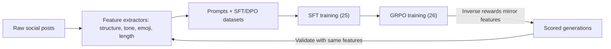

# Social Media AI Engineering ETL

A manifest‑driven pipeline that turns social posts into training‑ready datasets for LLM fine‑tuning. Designed for fast setup, clear outputs, and repeatable runs.

This is the exact pipeline I used to build the LinkedIn model for the SaaS I shutdown, GrowGlad, and the smaller demo model I released, [LinkedQwen](https://huggingface.co/jacobpwarren/LinkedQwen2.5-14B-Instruct).

## What you get

- One command from raw JSONL to training splits (SFT and DPO)
- Clear outputs under data/processed/{RUN_ID}/ plus a manifest.json for easy re‑runs
- Prompt generation (18), dataset assembly (22), and final splits (23)
- Works on A100/H100; tested with Qwen2.5‑7B, Mistral-Nemo-2407, Qwen3-32B, and Llama‑3.1‑8B
- Simple follow‑on training scripts for SFT (25) and GRPO (26)
- Reward functions for tone, hashtags, emoji, length, structure, and more

## Quickstart

```bash
cd pipe
make setup           # install package + dev tools
make setup-nlp       # one-time: download spaCy model + NLTK data
make smoke           # smoke test for 1 -> 2 -> 3 using run-id ergonomics
make run-tail RUN_ID=demo  # tail-only: 17-18, 22-23 (assumes features already exist for RUN_ID)
```

Inputs: use the tiny demo dataset `./example-dataset.jsonl`.

## Hardware requirements

This pipeline targets GPU-backed LLM fine-tuning and guided decoding. A data‑center NVIDIA GPU is required for vLLM stages and is strongly recommended end‑to‑end.

- Supported GPUs: NVIDIA A100 (40GB/80GB) minimum; H100/H200 preferred for throughput and long contexts
- CUDA: 12.1–12.3 recommended (ensure PyTorch/vLLM builds match). NVIDIA Driver ≥ 535
- Host: Python 3.9+, 32GB RAM+, fast SSD (10–50GB free for artifacts), Linux preferred
- Notes:
  - Ensure NCCL/CUDA toolkit versions match the installed PyTorch and vLLM wheels
  - Large models may require tensor/kv cache sharding or reduced batch sizes on A100‑40GB

## Data layout

All artifacts for a run are written under data/processed/{RUN_ID}/ with a manifest.json capturing lineage, signatures, and outputs.

Example structure:

```
data/processed/demo-run/
  01-best-posts.jsonl
  02-labeled.jsonl
  03-structures.jsonl
  17-posts-with-writing-style.jsonl
  18-with-prompts.jsonl
  22-ready-dataset.csv
  23-sft.csv
  23-dpo.csv
  manifest.json
```

Example manifest.json snippet:

```
{
  "run_id": "demo-run",
  "stages": {
    "18-prompts": {
      "input": "data/processed/demo-run/17-posts-with-writing-style.jsonl",
      "outputs": ["data/processed/demo-run/18-with-prompts.jsonl"],
      "signature": "sha256:…",
      "completed_at": "2025-08-24T12:34:56Z"
    }
  }
}
```


## Stages and artifacts

Written under `data/processed/{RUN_ID}/`:

- 01: 01-best-posts.jsonl
- 02: 02-labeled.jsonl
- 03: 03-structures.jsonl
- 17: 17-posts-with-writing-style.jsonl (+ 17-partial-results.jsonl during long runs)
- 18: 18-with-prompts.jsonl
- 22: 22-ready-dataset.csv (+ Parquet mirror)
- 23: 23-balanced-dataset.csv, 23-sft.csv, 23-dpo.csv (+ Parquet mirrors)

A `manifest.json` in the same folder records inputs, outputs, config signature, and timestamps.


## Architecture (DAG)



## Philosophy (Emulate Framework)

This pipeline is aligned with my "Emulate" approach: begin with the workflow you want to automate, encode expert‑style signals (features), and then package standardized supervision data for model training. The high‑level summary below provides context for why I on expert‑style feature extraction and standardized training artifacts.

### Overview
Most AI deployments are information‑centric and underwhelming. The Emulate Framework is workflow‑first: it reverse‑engineers expert processes and encodes differentiating signals into AI capabilities that deliver measurable efficiency gains.

- Problem: information bots ≠ automated workflows; low leverage
- Solution: map expert workflows, capture differentiators, and build AI that completes tasks end‑to‑end
- Impact: real efficiency gains (often 60–80% time savings) and durable differentiation

### Philosophy highlights
- Product‑first, not data‑first
- Expertise over generic AI
- Competitive differentiation preserved
- Measurable efficiency via complete‑process automation

### Process overview
- Phase 1: Human Workflow Mapping (designed output, expert mapping, decomposition, target variables, quality definitions)
- Phase 2: Expert Style Fingerprinting (strategic data collection, differential feature engineering, impact validation, implementation)
- Phase 3: Modeling & Delivery (architectures, development/validation, packaging, implementation prep)

See the full philosophy at [Emulate Framework](https://emulateframework.ai).

## Usage (selected commands)

- End-to-end (all features to final splits):
  - `make run-e2e RUN_ID=demo DATASET=../course-dataset-clean.jsonl`
- Tail-only (assumes features exist for RUN_ID):
  - `make run-tail RUN_ID=demo`  (note: 17-writing-style expects an explicit --input when using --run-id; see Makefile or pass --input)
- Core ingestion + structure only:
  - `make run-core RUN_ID=demo DATASET=../course-dataset-clean.jsonl`
- Feature extraction only (with cleaners):
  - `make run-features RUN_ID=demo`

## Reward design

My reward functions are the **inverse** of the feature engineering functions that created the dataset. During GRPO, the model is scored on the same measurable constraints (tone, bullets, length, emoji, structure, coherence) that originally defined the training data. This creates tight alignment between data specification and optimization.

**Feature ↔ Reward symmetry:**
- Bullet style extraction -> bullet_style_reward_func
- Tone analysis -> tone_alignment_reward_func
- Emoji usage patterns -> emoji_usage_reward + emoji_variety_reward
- Post length constraints -> precise_post_length_reward
- Sentence structure -> sentence_structure_reward_func
- Topic consistency -> semantic_coherence_reward
- Narrative flow -> narrative_structure_reward_func

**Tacit feature engineering:** I reverse-engineer human writing patterns that are hard to specify directly (pacing, sentiment arcs, vocabulary richness, punctuation style) into measurable functions. The model learns to "emulate" these tacit human approaches through explicit reward signals rather than hoping they emerge from generic training.

This approach is novel because most reward functions are either human preference proxies or generic quality metrics. I instead create programmatic rewards that mirror the exact specification used to build the dataset.

### Example: how a completion is scored

- Constraints: Length 750–1500; Emoji: high; Tone: witty, inspiring; Bullets: •
- Completion (excerpt):
  > I bootstrapped my way from zero to traction by doing the unsexy work daily. Here’s the part nobody tells you: momentum compounds when you show up before motivation does.

- Reward scores (illustrative):
  - precise_post_length_reward: 0.92
  - emoji_usage_reward: 0.85
  - tone_alignment_reward: 0.80
  - bullet_style_reward: 1.00
  - semantic_coherence_reward: 0.78
  - weighted_total (weights.example.json): 0.86

### Evaluate rewards quickly

- CPU-only quick check: `make eval-rewards`
  - Uses training/rewards/weights.example.json and writes a simple report under reports/
  - Customize: `make eval-rewards EVAL_RUN=mytest` or pass a different `--weights`
- Tune weights, re-run GRPO, sample generations, and compare aggregate scores over a fixed prompt set.

### Feature ↔ Reward symmetry loop




## Optional extras

- Ablation (Stage 4): small research run to see which structure features matter
- Streamlit demo: quick scoring UI for generated posts


## Licensing

- Code in this repository is licensed under the Apache License, Version 2.0.
- Third‑party models (e.g., Qwen) and datasets are governed by their own licenses/terms; review and comply with those separately.


If you have a project that could benefit from the Emulate Framework, please reach out to discuss how we can work together. You can reach me at [LinkedIn](https://www.linkedin.com/in/jacobpaulwarren/).